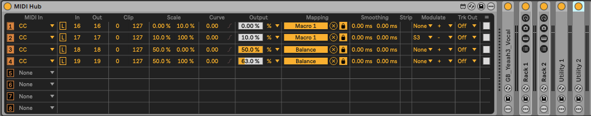

# touche-spatializer

A Max4Live device for expressive spatial audio control using the Touché SE controller.

## Overview

This project explores the use of continuous gesture control for real-time sound
spatialization. The Touché SE's four axes are mapped to perceptually meaningful
spatial parameters, turning physical gesture into movement through sonic space.

## Current mapping

| Touché axis | Spatial parameter | Perceptual effect |
|---|---|---|
| Front / back pressure | Reverb + low-pass filter | Distance (near <-> far) |
| Left / right lateral | Stereo panning | Horizontal position |

## Motivation

Standard spatial audio tools rely on discrete controls. This project investigates
whether continuous, gesture-based control can produce more natural and expressive
spatial trajectories — closer to how a performer moves through a physical space.

## Setup

- Ableton Live
- Max4Live device: `max4live/MIDI Hub.amxd`
- Touché SE connected via MIDI

## Roadmap

- Quadraphonic output
- Elevation control (dome / ambisonics)
- HRTF-based binaural rendering
- Gesture recording and playback
- Multi-source spatialization

## Why this matters

Spatial audio and timbral control share a common challenge: mapping
low-dimensional gesture to high-dimensional perceptual spaces in a musically
meaningful way. This project extends the gesture-to-sound research direction
of `expressive-ks` into the spatial domain.
